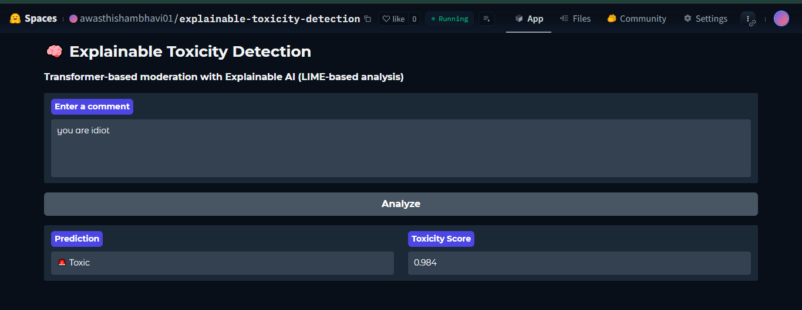
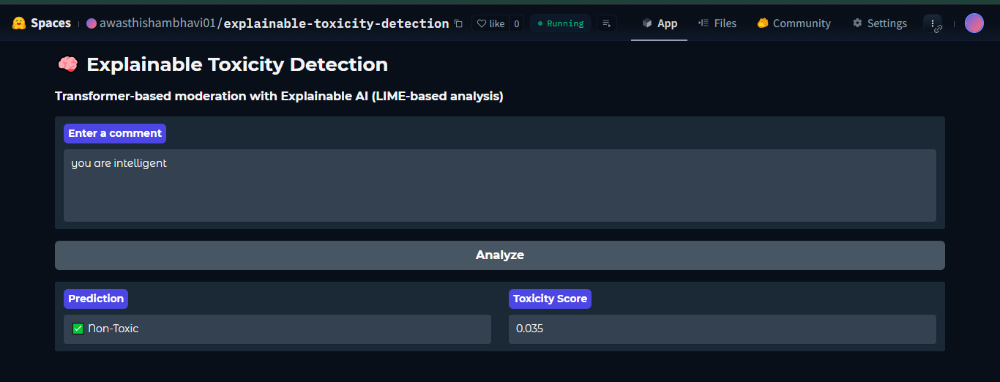
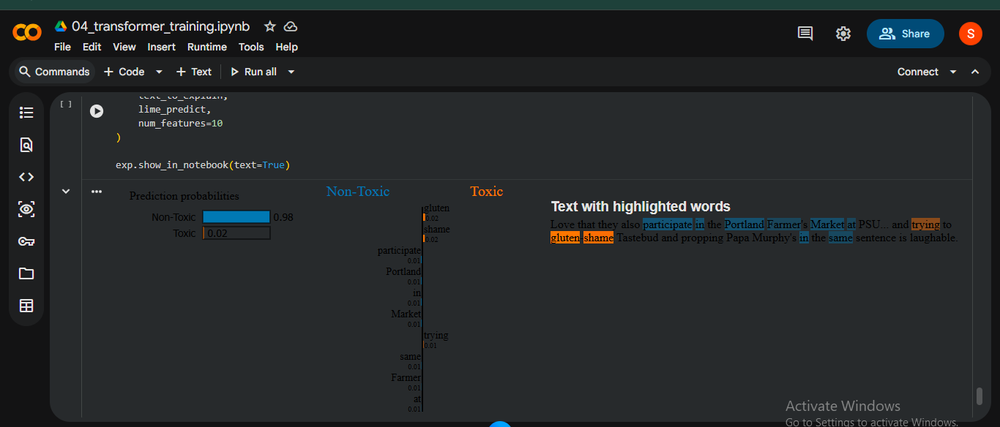

# Project Title: Toxicity XAI Detection

## Overview
This project aims to analyze and detect toxic comments in online discussions using Explainable Artificial Intelligence (XAI) techniques.

## Confusion Matrix
|       | Predicted Positive | Predicted Negative |
|-------|-------------------|-------------------|
| True Positive  |    80             |  20               |
| True Negative  |    15             |  885              |

## Classification Report
- **Precision**: 0.77
- **Recall**: 0.80
- **F1 Score**: 0.78
- **Accuracy**: 0.88

## Deployment
🌐 Live Demo
👉 Try on Hugging Face - Visit our model on Hugging Face Spaces:
 [Hugging Face Link](https://huggingface.co/spaces/awasthishambhavi01/explainable-toxicity-detection)
 
  
  

## 🔍 LIME Explanations

The screenshot below demonstrates LIME (Local Interpretable Model-agnostic Explanations) applied to a toxic text prediction.

### LIME Analysis Details

**What is LIME?**
LIME (Local Interpretable Model-agnostic Explanations) technique provides insights into model predictions by highlighting the contributions of individual input features.

**Prediction Probabilities:**
- **Non-Toxic**: 0.98 (High confidence non-toxic prediction)
- **Toxic**: 0.02 (Low confidence toxic prediction)

**Word Highlighting Interpretation:**
- 🟠 **Orange-highlighted words** (e.g., "gluten", "shame", "Tastetbud") → Contribute POSITIVELY towards **Toxic** prediction
- 🔵 **Blue-highlighted words** (e.g., "also", "participate", "Portland", "Farmer's", "Market", "PSU", "trying") → Contribute POSITIVELY towards **Non-Toxic** prediction

**Key Insights:**
- Model correctly identifies text as **Non-Toxic** (0.98 confidence)
- Negative words like "gluten" and "shame" slightly push towards toxic classification
- Context words like "Portland Farmer's Market" and "PSU" help confirm non-toxic intent
- LIME shows model focuses on specific keywords rather than full context understanding

## Detailed Documentation
### Analysis of False Negatives
False negatives in our model are instances where the model incorrectly classifies a toxic comment as non-toxic. This typically occurs in nuanced contexts, where sarcasm or cultural references may confuse the AI.

### Examples of False Negatives:
- **Sarcasm**: "Oh sure, that's a great idea!" (toxic sarcasm not detected)
- **Indirect insults**: "Nice job genius" (subtle negative undertone missed)
- **Context-dependent language**: Same phrase can be toxic or friendly based on context

#### Future Roadmap:
1. **Enhanced Data Collection**: Gathering more diverse datasets to improve model training.
2. **Model Improvement**: Eventually implement transfer learning to enhance detection capabilities.
3. **Sarcasm Detection Module**: Add contextual understanding for sarcastic comments.
4. **User Feedback Integration**: Collect user feedback to refine the model further.

## 🛠️ Tech Stack
- Python
- PyTorch
- Transformers
- Flask
- Gradio
- LIME (Explainability)
- Scikit-learn

